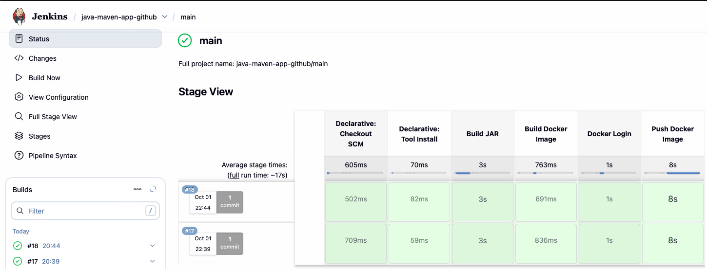

# Java Maven Application — Jenkins CI Pipeline

## Overview

A Jenkins-based CI project for a Java / Spring Boot application. A GitHub webhook automatically triggers a Jenkins Multibranch Pipeline, which loads a reusable Jenkins Shared Library to package the application with Maven, build a Docker image, authenticate to Docker Hub using Jenkins Credentials, and publish the image.

The application serves a static welcome page over HTTP on port `8080`.

Application repository: [jenkins-java-maven-cicd](https://github.com/Johnpaul790/jenkins-java-maven-cicd).

## Architecture

```text
Developer pushes to GitHub
        ↓
GitHub Webhook
        ↓
Jenkins Multibranch Pipeline
        ↓
Jenkins Shared Library
        ↓
Maven clean package
        ├── Compile application
        ├── Run Spring Boot integration test
        └── Package executable JAR
        ↓
Docker image build
        ↓
Docker Hub authentication
        ↓
Docker Hub push
```
A push to the application repository automatically sends a GitHub webhook to Jenkins. Jenkins scans the multibranch project, detects the updated main branch, and starts the application pipeline without requiring a manual build.

The pipeline then loads the reusable Jenkins Shared Library and executes the Maven and Docker workflow.


## Pipeline Stages

The declarative pipeline runs on `agent any` and uses the Jenkins Maven installation named `maven-3.9.12`.

| Stage | Description |
| --- | --- |
| Build JAR | Runs `mvn clean package`. |
| Build Docker Image | Builds the Docker image. |
| Docker Login | Authenticates to Docker Hub. |
| Push Docker Image | Pushes the image to Docker Hub. |

## Pipeline Execution

When changes are pushed to the application repository, the GitHub webhook
automatically triggers the Jenkins Multibranch Pipeline.

The pipeline then:

1. Builds the Java application with Maven.
2. Runs the automated integration test.
3. Packages the application as a JAR.
4. Builds the Docker image.
5. Authenticates to Docker Hub.
6. Pushes the image to Docker Hub.




## Automated Testing

The Maven build includes an automated Spring Boot integration test located at:

`src/test/java/com/example/ApplicationIntegrationTest.java`

The test starts the Spring Boot application using a random available port and sends HTTP requests to the root endpoint (`/`).

It verifies that:

- the application responds with HTTP `200 OK`;
- the returned page contains `Welcome to Java Maven Application`.

The test runs automatically as part of:

```bash
mvn clean package
```

If the integration test fails, Maven returns a failed build result and Jenkins stops the pipeline before the Docker image build and push stages.

This acts as a CI quality gate, ensuring that a Docker image is only built and published when the application successfully passes its automated test.

## Jenkins Shared Library

Reusable CI logic is maintained in the separate [jenkins-shared-library repository](https://github.com/Johnpaul790/jenkins-shared-library). The Jenkinsfile loads it with:

```groovy
@Library('jenkins-shared-library') _
```

The application repository defines the pipeline stages and image name. The shared library provides `buildJar()`, `buildImage(env.IMAGE_NAME)`, `dockerLogin()`, and `dockerPush(env.IMAGE_NAME)` for build, authentication, and publishing.

## Repository Structure

```text
.
├── Jenkinsfile                         # Declarative pipeline and shared-library integration
├── Dockerfile                          # Java runtime image and JAR entrypoint
├── pom.xml                             # Maven dependencies and executable JAR packaging
├── README.md
├── .gitignore
├── pictures/
│   └── Jenkins-pipeline.png            # Jenkins pipeline screenshot
└── src/main/
    ├── java/com/example/Application.java
    └── resources/static/index.html
```

## Technologies

- **CI / Automation:** Jenkins, Jenkins Shared Libraries, Groovy.
- **Application and build:** Java 8, Spring Boot, Maven.
- **Containers and registry:** Docker, Amazon Corretto 8 runtime, Docker Hub.
- **Version control and hosting:** Git, GitHub.

## Docker Image

The Jenkins pipeline builds and publishes the Docker image as:

```text
johnpaula/demo-app-2.2:latest
```

In the current setup, `demo-app-2.2` is the Docker Hub repository name and `latest` is the image tag.

Maven packages the application as:

```text
target/java-maven-app-1.1.1.jar
```

Instead of hardcoding that versioned JAR filename in the container runtime configuration, the Dockerfile copies the generated artifact to the stable name `app.jar`:

```dockerfile
COPY ./target/java-maven-app-*.jar /usr/app/app.jar
WORKDIR /usr/app
ENTRYPOINT ["java", "-jar", "app.jar"]
```

This keeps the Docker runtime configuration independent of the Maven application version. If the Maven artifact version changes later, the Dockerfile does not need to be updated just to match the new JAR filename.

The image uses `amazoncorretto:8-alpine3.17-jre` as the Java runtime and exposes port `8080`.

## Credentials and Security

Docker Hub credentials are stored in Jenkins Credentials under the credential ID `docker-hub-repo` rather than being committed to the application or Shared Library repositories.

The pipeline injects the Docker Hub username and password at runtime using Jenkins `withCredentials`. The shell expands the credential environment variables when running `docker login --password-stdin`, avoiding Groovy string interpolation of secrets.

This keeps authentication data outside the source repositories while allowing the pipeline to authenticate to Docker Hub during image publishing.

## Runtime Verification

The resulting Docker image was manually run as a container. The Spring Boot application started successfully and responded over HTTP. This verification was performed manually and is not an automated pipeline stage.

## Current Scope

**Implemented:**

- Automatic pipeline triggering from GitHub pushes using a repository webhook.
- Jenkins Multibranch Pipeline for branch-aware CI execution.
- Reusable Jenkins Shared Library for Maven and Docker pipeline operations.
- Maven build using `mvn clean package` to remove stale build artifacts before producing the JAR.
- Automated Spring Boot integration test executed during the Maven build.
- Integration test starts the application on a random port and verifies that the home page returns HTTP `200 OK` and the expected content.
- Failed automated tests stop the pipeline before Docker image build and publication.
- Docker image creation using the packaged Spring Boot JAR.
- Docker Hub authentication using Jenkins Credentials.
- Automated Docker image publication to Docker Hub.
- Manual runtime verification of the published Docker image.

**Not yet implemented:**

- Automated application deployment to a runtime environment.

## Project Background

A hands-on DevOps project focused on Jenkins pipelines, reusable Shared Libraries, automated Spring Boot integration testing, Maven builds, Docker image publishing, and secure credential management.
