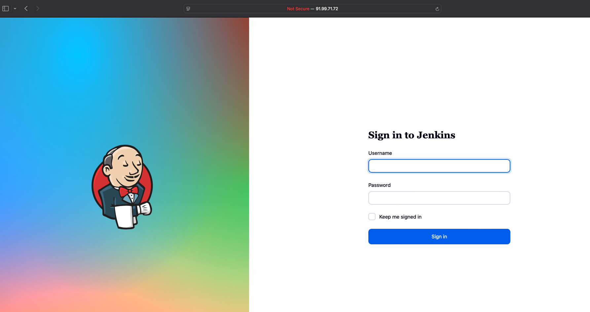
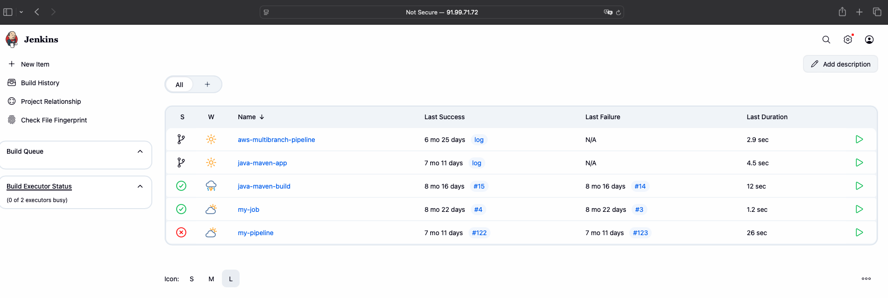

# Java Maven Application — Jenkins CI/CD Practice

A personal DevOps project that uses Jenkins to package a Java Spring Boot application with Maven, build a Docker image, and publish it to Docker Hub. The application serves a static welcome page and logs a startup message.

**Current scope:** build and image publishing are implemented. The `deploy` stage is a placeholder; no deployment target or running-container rollout is configured. The Docker entrypoint also needs the filename correction described below before the image can run.

## CI/CD workflow

The repository is hosted on GitHub. `Jenkinsfile` defines a declarative pipeline with `agent any` and the Jenkins Maven tool named `maven-3.9.12`. Job configuration, SCM triggers, and webhooks are outside this repository.

| Stage | Implementation |
| --- | --- |
| `init` | Loads the repository's `script.groovy` into `gv`. |
| `build jar` | Calls `gv.buildJar()`, which runs `mvn package`. |
| `build image` | Calls `gv.buildImage()` to build, authenticate, and push `johnpaula/demo-app-2.2`. |
| `deploy` | Calls `gv.deployApp()`, which only prints `deploying the application...`. |

## Repository structure

```text
.
├── Jenkinsfile                         # Pipeline stages and Maven tool selection
├── script.groovy                       # Build, image publishing, and deployment placeholder
├── Dockerfile                          # Java runtime image and JAR entrypoint
├── pom.xml                             # Maven dependencies and packaging
├── .gitignore                          # Ignores target and IDE files
└── src/main/
    ├── java/com/example/Application.java
    └── resources/static/index.html
```

## Maven build and tests

`pom.xml` defines `com.example:java-maven-app:1.1.1`, compiles for Java 8, and uses the Spring Boot Maven plugin to repackage the application as an executable JAR: `target/java-maven-app-1.1.1.jar`.

```sh
mvn package
java -jar target/java-maven-app-1.1.1.jar
```

With a compatible JDK and Maven installed, the application can be opened at `http://localhost:8080/`. `mvn package` includes Maven's test phase, but this repository contains no test sources. JUnit is declared as a test dependency; there is no separate Jenkins test stage. `getStatus()` returns `OK` as a Java method and is not exposed as an HTTP endpoint.

## Docker build and Docker Hub publishing

`Dockerfile` uses `amazoncorretto:8-alpine3.17-jre`, copies `target/java-maven-app-*.jar` into `/usr/app/`, and exposes port `8080`. Jenkins executes:

```sh
docker build -t johnpaula/demo-app-2.2 .
docker push johnpaula/demo-app-2.2
```

No explicit image tag is supplied, so Docker uses `latest`: `johnpaula/demo-app-2.2:latest`. The `2.2` is part of the repository name, not a version tag. Image reference: [Docker Hub — johnpaula/demo-app-2.2](https://hub.docker.com/r/johnpaula/demo-app-2.2). These commands document the publishing configuration, not confirmation of a successful push.

**Known runtime issue:** the Docker entrypoint names `java-maven-app-1.0-SNAPSHOT.jar`, while the current Maven version produces `java-maven-app-1.1.1.jar`. Align that entrypoint with the generated artifact before running the container. After that correction and a successful Maven build:

```sh
docker build -t johnpaula/demo-app-2.2 .
docker run --rm -p 8080:8080 johnpaula/demo-app-2.2
```

This is a manual local run; the Jenkins `deploy` stage does not execute it.

## Jenkins setup and credentials

To reproduce the pipeline, configure a Jenkins Pipeline job to use this repository's `Jenkinsfile`. The selected agent needs a compatible JDK, Docker CLI, access to a Docker daemon, and a Jenkins Maven installation named `maven-3.9.12`.

Configure a Jenkins username/password credential with ID `docker-hub-repo` for an account permitted to push to the Docker Hub repository. `script.groovy` binds it to `USER` and `PASS`, then authenticates using `docker login --password-stdin`. Secrets are managed outside the repository through Jenkins Credentials; credential values must not be committed.

## Jenkins portal access and pipeline progress

I connected to my server over SSH and started the Jenkins Docker container. I can now access the [Jenkins sign-in page](http://91.99.71.72:8080/login?from=%2F) and sign in to the dashboard.

### Sign-in page

The Jenkins portal is reachable on port `8080`.



### Jenkins dashboard

After signing in, I can see my existing jobs, including `java-maven-app` and `my-pipeline`.



**Progress:** server access, container startup, and portal access are complete. My next step is to trigger the intended pipeline and inspect its build results. These screenshots document portal access; they do not confirm a new pipeline run. I will add more screenshots as I continue.

## Shared Library relationship

Related personal project: [Jenkins Shared Library](https://github.com/Johnpaul790/jenkins-shared-library).

The current `Jenkinsfile` has no Shared Library declaration or calls. It uses `load "script.groovy"` to load a local helper script. Integration with the related repository is not demonstrated by the current application code.

## Technologies used

- Git / GitHub for source hosting; Jenkins declarative Pipeline and Groovy for automation.
- Maven, Java 8 compilation, Spring Boot web starter `2.3.4.RELEASE`, and Spring Boot Maven plugin `2.3.5.RELEASE`.
- Docker, Amazon Corretto 8 runtime image, and Docker Hub publishing.
- SLF4J startup logging; JUnit `4.13.1` and Logstash Logback Encoder `6.4` are declared dependencies. No tests or Logstash integration configuration are included.

## What I practiced / demonstrated

- Defining Jenkins stages and loading reusable functions from a local Groovy script.
- Packaging a Java application with Maven and preparing a container image.
- Using Jenkins Credentials for Docker Hub authentication and image publishing.
- Identifying the boundary between implemented CI steps and a deployment placeholder.
